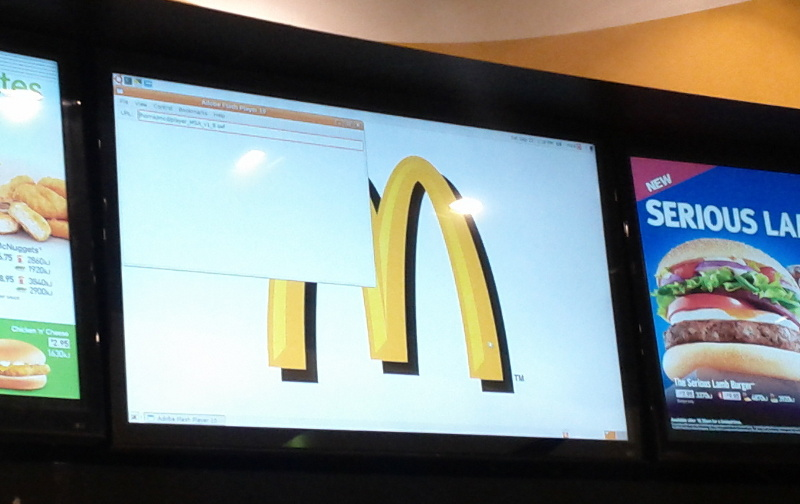
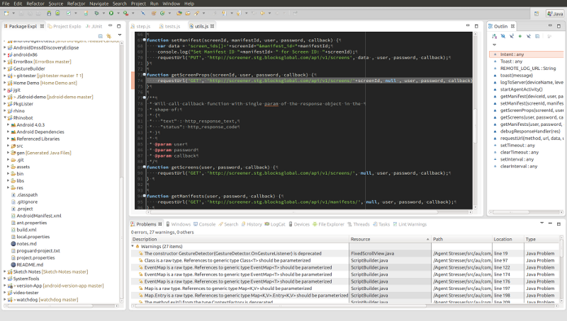

    Just the start page

Project Grimlock  - Bringing JS to Android

    welcome to the presentation. 
    I am going to talk about using javascript for writing Android apps.

    Before I start, coudl I please have a show of hands who has done

Why?

    Why did I want to use javascript in Android.
    
The Problem:
----
Testing Android Appliances

    So the last year I ahve been working on an Android app to make devices
    into Interactive Digital Signage Appliances.

Interactive Digital Signage Appliances ?
----

    So what are interactive digital signage appliances?

But Wait! Theres more...  
  
(4pm Today)

    If you want to know abit more about building appliances with android, please
    come to my other talk this afternoon! :-)

Failure is not an option  

-Book Title by Gene Krantz, NASA Flight Director

    
    Now the thing with this kind of application is that its more like a website
    than your typical mobile phone app in that its on public display pretty much
    constantly. So you can't just assume that you can simply crash and the user
    will restart your app.
   

    On the otherhand...

    And lest your start laughing to loudly at our corporate operating system
    friends...

    It happens to everyone.

So we need stress testing

    So what we need is the kind of stress testing we use for websites and other
    long running applications, as things like slow memory leaks become problems.

Nothing handy

    But the existing Android testing framework was intended for doing unit and
    intergration testing, not these kind of long running tests.

Enter the Rhino

    And thats where javascript comes into the picture.  
    Because I thought it would be more productive to write these tests in a 
    lightwirght scripting language like javascript instead of a bulky, 
    pre-compiled language like Java.
    
Mozillas Rhino:
---
A Javascript Engine written in Java

    So Rhino from Mozilla is a javascript engine, like the better known 
    Spidermonkey and V8 that are in Firefox and Chrome, but Rhino is written in
    Java and interfaces very nicely with Java libraries.

    But what really made think of trying to use javscript and rhino for android
    development was this tweet from Hannes Wallnöfer, one of the maintainers of
    the Rhino project.

Android App Development...  
in 60sec

    Now before I can get to showing you what the code looks like, I'll need to 
    give a quick into to Android programming concepts. 
    
GO!

    So...

Don't call us, we'll call you

    Android is a Framework which basically means it follows whats called the 
    Hollywood principle. Unlike the case with things like desktop OS apps which
    tend to be in control and they call into libraries.
    
Activity -> Onscreen Display

    There are activities, which basically represent a screen of ui elements the
    user is looking at and only 1 activity at a time is active. Normally apps 
    are made up of 1 or more activities.
    
Activities have a lifecycle

    Android is a framework where apps run according to a strict lifecycle, which
    means that your code only get called by the system in reponse to specific
    events occuring, your activity does not just keep constantly running like a
    application would on a desktop OS.
    
Services -> Run in the background

    Which brings us to services, which like Activities, also have a lifecycle,
    but they do keep running constantly in the background and need to take 
    special measures to communicate with the activity currently running onscreen
    
Intents -> Message Bus

    And finally Intents are a messaging service which allows all the components
    to efffectively communicate with each other and ties the whole system
    together. Intents are really the heart of Android and probably the single 
    most important aspect of Android - its really what makes Android, Android 
    and not just another Linux distro.
    
In know Android!  

    So now you know all there is to know about Android programming.
    
The code...

      Let have a look at what the js code look like, starting with some I wrote
      for one of my stress tests
    
<pre>
var Intent = android.content.Intent;
var Uri = android.net.Uri;

console.info("Starting Stress Test script...");

broadcasts.on({
  receive: function(bintent) {
      var EXTRA_DEVICE_ID = "au.com.sct.agent.EXTRA_DEVICE_ID",
      EXTRA_API_TOKEN = "au.com.sct.agent.EXTRA_API_TOKEN";
      
      console.info(broadcastCounter+"] Got broadcast intent: "+bintent);
      broadcastCounter++;        
        
      switch (bintent.getAction()) {
      case (URL_DISPLAY_ACTION) :
          displayedUrl = bintent.getDataString();
          console.info("Url DISPLAYED "+displayedUrl);
          getManifest(deviceID, apiToken, 'x', function(err, res) {
             var manifest, manifestUrl;
             try {
                 if (res.status === 200) {
                     manifest = JSON.parse(JSON.parse(res.text).body);
...
</pre>

    like this.

Event Callbacks

    As I mentioned, Android is a framework so most useful things happen in 
    lifecycle callbacks so having a nice way to work with this is essential
    and I think the way jsdroid does this is very natural and feels right for
    any who has used EventEmitters in Nodejs.

Ported XHR

    of course everyone one needs to use http, including even my tests.
    So I ended porting a implementation of XHR to android.
    
Using Existing JS

    I was also able to easily make use of some generic JS libraries that I 
    was used to using with Nodejs such as the Steps library which makes writing
    conceptually sequential code much easier in a asynchronous environment of JS

Best Laid Plans...

    Now while I did end up getting it work and it proved usual in finding a 
    number of bugs due to long running tests, the results in using Javascript
    instean of Java were not as I'd hoped for. I found it even more cumbersome
    writing the tests in javascript and it didn't feel anymore productive.
    
So what went wrong?

    So what went wrong?
    
Off-Device  Development
    The main problem was that I still needed to move js files to the emulator or
    device. I was editing the files with my usual desktop text editor.

Poor Tooling

    BUT there was none of the tool support I was used to with writing android 
    code in Java using a IDE, like auto-completion to help with the using the 
    huge Android API.
    This got me thinking about why javascript was such a nice fit for the browser
    and on the server with Nodejs, but not for Android?
    
Bánffy-Bray criteria
----
> 1. Static typing’s attractiveness is a direct function  
>    (and dynamic typing’s an inverse function) 
>    of API surface size.
> ...

    Luckily smarter people than I, namely Tim Bray, whose at Google these days,
    has already noticed that using Java for Android was actually not too bad
    and nothing like doing web development with Java and vice versa when it 
    came to dynamic languages.
    [Link](http://www.tbray.org/ongoing/When/201x/2011/12/27/Type-Systems)

Solutions?

    So what can we do?
    
On-Device Development

    Well on device development seemed like a pretty important starting point
    as not developing on the device certainly seemed important to not losing
    the benefits os using a dynamic langauge like JS.

BUT is On-Device Development Possible?

    But was it possible?
    Well I didn't know and had lots of other presssing work to do so there I 
    left things until late last year when I began thinking about development
    on mobile, touch-screen based devices.

Editing, feedback - a REPL

    So we need to be able to edit JS on the device, ideally in some form of REPL
    in order to get a workflow with immediate feedback.
    
Better Tools

    And we need better tooling to allow for a exploratory programming workflow.

IDEs!

    Now on the desktop, there is already an answer for this: IDEs
    Even many web-developers who claim to spurn using IDEs for text editors,
    effectively end up using an IDE everytime they fire up Firebug or Chromes 
    developer tools.

    But on the desktop this is what IDEs like Eclipse and Intellj look like. 

    Ok, people don't use 42in desktop monitor, but you get the idea.
    This is not going to work on device with screens of 10inch or less!
    Won't matter if they have lovely Retina screens or not.
    img-src: https://developers.google.com/tv/android/docs/gtv_android_patterns

Better UIs!

    So what we need is not only better tooling but also a whole new approach to
    the user interfaces for those tools.

Enter Rhinobot

    So I've now started a project call Rhinobot which I intend to use as a 
    platform for exploring how to build these better tools for not just using 
    javascript on Andriod, but being abel to do serious programming on these
    new, small mobile devices we have now.

What its like so far

    so far its only in a very basic state.

Help  

http://github.com/maks/rhinobot

    So if you are interested in checking it out or even helping, just head over
    to github and clone away.    
    
Thank You!  
Questions?  

blog.manichord.com  
maks@manichord.com  
github.com/maks  
@mklin

    and thats it.
    Thank you! and any questions?
    