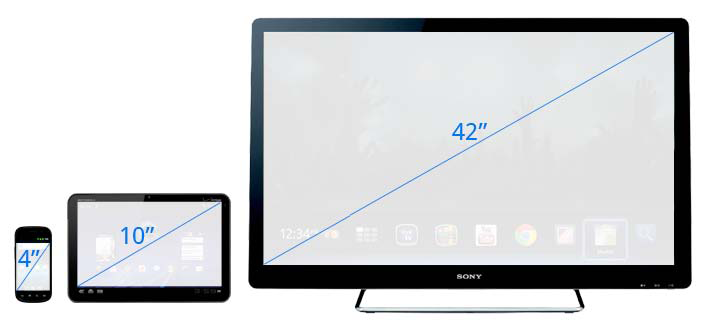

    Just the start page

Project Grimlock  - Bringing JS to Android

    welcome to the presentation. 
    I am going to talk about using javascript for writing Android apps.
    
Why?

    Why did I want to use javascript in Android.
    
The Problem:
----
Testing Android Appliances

    So the last year I ahve been working on an Android app to make devices
    into Interactive Digital Signage Appliances.

Interactive Digital Signage Appliances ?
----

    So what are interactive digital signage appliances?

Coming Soon...(4pm Today!)

    If you want to know abit more about building appliances with android, please
    come to my other talk this afternoon! :-)

Failure is not an option  

-Book Title by Gene Krantz, NASA Flight Director

    
    Now the thing with this kind of application is that its more like a website
    than your typical mobile phone app in that its on public display pretty much
    constantly. So you can't just assume that you can simply crash and the user
    will restart your app.
   

    On the otherhand...

    And lest your start laughing to loudly at our corporate operating system
    friends...

    It happens to everyone.

So we need stress testing

    So what we need is the kind of stress testing we use for websites and other
    long running applications, as things like slow memory leaks become problems.

Nothing handy

    But the existing Android testing framework was intended for doing unit and
    intergration testing, not these kind of long running tests.

Enter the Rhino

    And thats where javascript comes into the picture.  
    Because I thought it would be more productive to write these tests in a 
    lightwirght scripting language like javascript instead of a bulky, 
    pre-compiled language like Java.
    
Mozillas Rhino:
---
A Javascript Engine written in Java

    So Rhino from Mozilla is a javascript engine, like the better known 
    Spidermonkey and V8 that are in Firefox and Chrome, but Rhino is written in
    Java and interfaces very nicely with Java libraries, making it a perfect fit
    for use on Android.

The code...

    So what did the js code look like?
    
<pre>
"use strict";

var Intent = android.content.Intent;
var Uri = android.net.Uri;

var broadcastCounter = 0,
    deviceID,
    apiToken,
    displayedUrl,
    flipflopRunning = false,
    URL_DISPLAY_ACTION = "au.com.sct.agent.URL_DISPLAYED",
    DEVICE_REGISTERED_ACTION = "au.com.sct.agent.DEVICE_REGISTERED",
    FLIP_FLOP_PERIOD = 5 * 60; //period between switching manifest

console.info("Running Stress Test script...");
logToServer(deviceID, "info", "Starting Stress Tests");
broadcasts.on({
    receive: function(bintent) {
        var EXTRA_DEVICE_ID = "au.com.sct.agent.EXTRA_DEVICE_ID",
        EXTRA_API_TOKEN = "au.com.sct.agent.EXTRA_API_TOKEN";
        
        console.info(broadcastCounter+"] Got broadcast intent: "+bintent);
        broadcastCounter++;        
        
        switch (bintent.getAction()) {
        case (URL_DISPLAY_ACTION) :
            displayedUrl = bintent.getDataString();
            console.info("Url DISPLAYED "+displayedUrl);
            getManifest(deviceID, apiToken, 'x', function(err, res) {
               var manifest, manifestUrl;
               try {
                   if (res.status === 200) {
                       manifest = JSON.parse(JSON.parse(res.text).body);
                       manifestUrl = manifest.home.source + "/" +manifest.home.start;
                       if (manifestUrl === displayedUrl) {
                           logToServer(deviceID, "info", "Displaying CORRECT Url "+displayedUrl);
                       } else {
                           logToServer(deviceID, "error", "Displaying INCORRECT Url "+ 
                                   displayedUrl + 
                                   " should have been "+manifestUrl);
</pre>

    like this.

Best Laid Plans...

    Now while I did end up getting it work and it proved usual in finding a 
    number of bugs due to long running tests, the results in using Javascript
    instean of Java were not as I'd hoped for. I found it even more cumbersome
    writing the tests in javascript and it didn't feel anymore productive.
    
So what went wrong?

    So what went wrong?
    The main problem was that I still needed to move js files to the emulator or
    device. I was editing the files with my usual desktop text editor BUT there 
    was none of the tool support I was used to with writing android code in Java 
    using a IDE, like auto-completion to help with the using the huge Android 
    API.
    This got me thinking about why javascript was such a nice fit for the browser
    and on the server with Nodejs, but not for Android?
    
Bánffy-Bray criteria
----
> 1. Static typing’s attractiveness is a direct function 
>    (and dynamic typing’s an inverse function) of API surface size.
> 2. Dynamic typing’s attractiveness is a direct function 
>    (and static typing’s an inverse function) of unit testing workability.

    Luckily smarter people than I, namely Tim Bray, whose at Google these days,
    has already noticed that using Java for Android was actually not too bad
    and nothing like doing web development with Java and vice versa when it 
    came to dynamic languages.
    [Link](http://www.tbray.org/ongoing/When/201x/2011/12/27/Type-Systems)

BUT On-Device Development ?

    So there I left things until late last year when I began thinking about 
    development on mobile, touch-screen based

IDEs!

    IDEs.

    Most people use IDEs like Eclipse and Intellj for development. 

    Ok, people don't use 42in desktop monitor, but you get the idea.
    This is not going to work!
    img-src: https://developers.google.com/tv/android/docs/gtv_android_patterns

Solutions?

    So what can we do?
    
Rethinking JS

    So we need to be able to edit JS on the device, ideally in some form of REPL
    
Tools

    And we need better tooling to allow for quick, exploratory programming
    workflow.

Enter Rhinobot

    A better tool for using javascript on Andriod.

Thank You!  
Questions?  

blog.manichord.com  
maks@manichord.com  
github.com/maks  
@mklin

    Thank you!
    